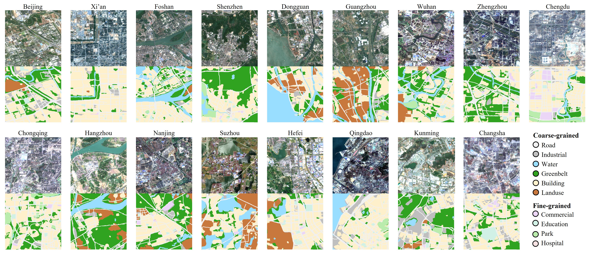

# UFRI
Urban Functional Region Identification (UFRI) Dataset, which is publicly available at [here](https://pan.baidu.com/s/1ZMpZhzifnengh0aVgyVTlg).

# Code
The complete code and details are coming.
# Acknowledgement
Many thanks for the *GeoSeg*(https://github.com/WangLibo1995/GeoSeg) and *pytorch_lightning*(https://www.pytorchlightning.ai/) contributions to our benchmark.
